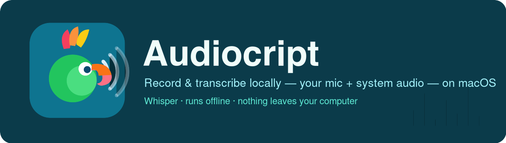
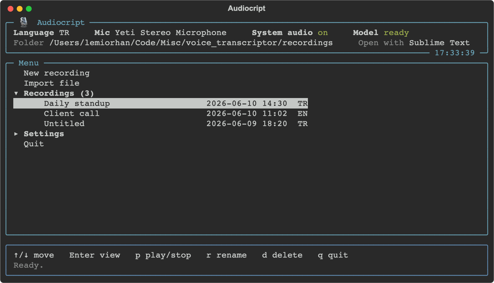
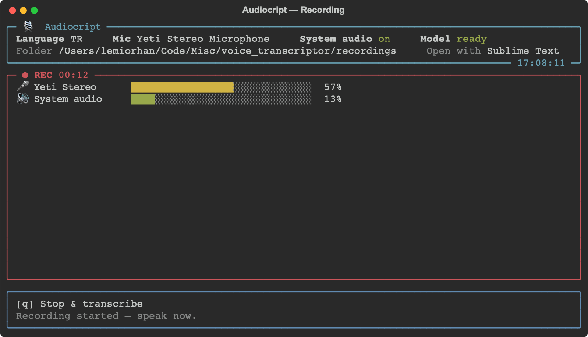
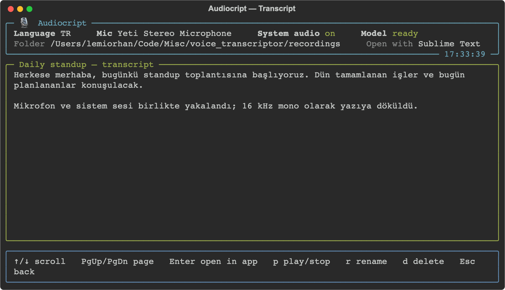
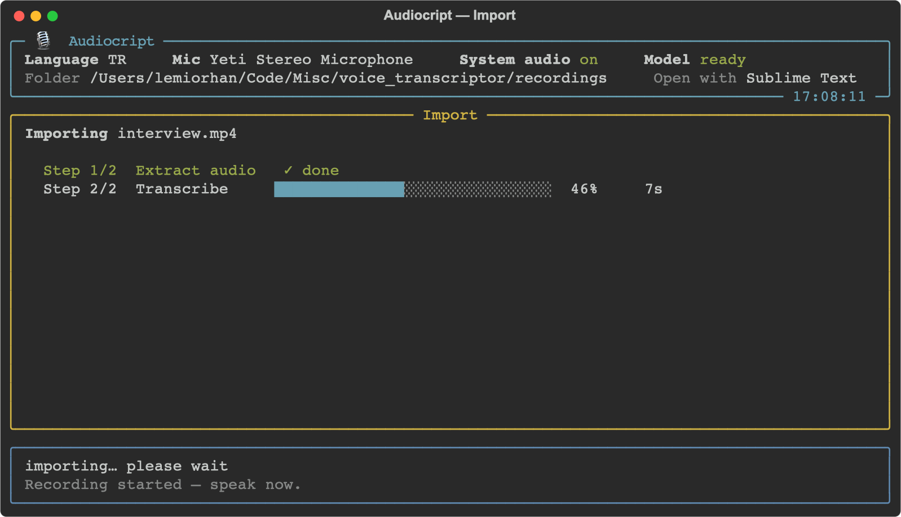

<div align="center">



**Record & transcribe audio locally with Whisper — on macOS.**
Capture your microphone *and* your system audio at the same time, watch live level
meters, and get a saved transcript. Everything runs on your machine.

[](LICENSE)
[](#requirements)
[](#requirements)
[](#models-per-language)
[](#how-it-works)

</div>

---

<div align="center">






</div>

---

## Features

- **Full-screen terminal app** with **arrow-key navigation** and a grouped,
  collapsible menu — no commands to memorize.
- **Record mic + system audio together** — your voice and the computer's output
  (a call, a video) are captured simultaneously and mixed into one track.
- **System audio without BlackHole** — a native macOS **Core Audio process tap**
  keeps your audio playing through your speakers while it's captured. No virtual
  cable, no Multi-Output Device, no rerouting.
- **Live level meters (VU)** — see whether each source is actually being captured
  (`no signal` is shown for a silent one).
- **Named recordings** — name a recording when you create it, and rename any
  recording at any time.
- **Browse & read transcripts in-app** — a scrollable viewer; press `Enter` to
  open the transcript in your preferred external app.
- **Import existing media** — transcribe an `mp4`, `mov`, `wav`, `mp3` or `m4a`
  file with a live progress bar.
- **Per-language models** for quality (Turkish & English — see [below](#models-per-language)).
- **Runs on the best device automatically** — CUDA → Apple Silicon (MPS/Metal) → CPU.
- **Background model pre-warming** so your first transcript is fast.
- **One command to run** — `./run.sh` sets everything up.

---

## Requirements

- **macOS 14.4+** (Core Audio process taps are used for system-audio capture).
- **Python 3.10+**.
- **Xcode / Command Line Tools (`swiftc`)** — only for the optional system-audio
  capture (a tiny Swift helper is compiled on first use).
- **ffmpeg** — only to import existing media files (`brew install ffmpeg`).

`run.sh` checks for these and offers to install the missing ones. The first run
downloads the transcription models (≈1.5–1.6 GB) and caches them.

---

## Quick start

```bash
./run.sh
```

`run.sh` creates the virtual environment, installs Python dependencies the first
time (and only when `requirements.txt` changes), offers to install the optional
external tools if missing, then launches the app.

> Permission denied? Run `chmod +x run.sh` once, or use `bash run.sh`.
> Pick a Python with `PYTHON=python3.11 ./run.sh`. Skip the tool check with
> `SKIP_DEP_CHECK=1`.

<details>
<summary>Manual setup</summary>

```bash
python3 -m venv .venv
source .venv/bin/activate
pip install -r requirements.txt
python audiocript.py
```
</details>

---

## Usage

Audiocript is a full-screen app you drive with the **arrow keys**.

| Context | Keys |
|---------|------|
| **Menu** | `↑`/`↓` move · `Enter` open/expand · `→`/`←` expand/collapse · `q` quit |
| **Menu — on a recording** | `Enter` view transcript · `p` play/stop audio · `r` rename · `d` delete |
| **Transcript viewer** | `↑`/`↓` scroll · `PgUp`/`PgDn` page · `Enter` open in external app · `p` play/stop · `r` rename · `d` delete · `Esc` back |
| **Text fields** (name / rename / folder / app filter) | type · `Enter` confirm · `Esc` cancel |
| **Microphone / app pickers** | `1`–`9` select · `Esc` cancel |
| **Delete confirmation** | `y` delete · any other key cancels |

The menu groups everything:

- **New recording** / **Import file** — you're asked for a name first (optional),
  then it records (or opens a file picker for `mp4`/`mov`/`wav`/`mp3`/`m4a`).
- **Recordings** — every project (name · date · language). On a selected recording
  you can **view** the transcript (`Enter`), **play/stop** its audio (`p`),
  **rename** it (`r`), or **delete** it (`d`, with confirmation). Inside the viewer
  the transcript scrolls and `Enter` opens it in your external app.
- **Settings** — language (TR/EN), microphone, system-audio capture, the
  "open with" app, and the recordings folder.

`Ctrl-C` exits cleanly at any time.

### While recording

A **"Preparing…"** screen appears while the mic and system-audio tap start up
(the first run may compile the helper or ask for a permission), then it switches
to live **VU meters** and shows **"Recording started — speak now."** Press `q` to
stop and transcribe.

### Importing a file

Audio is extracted (via ffmpeg) into a new project folder as `audio.wav`
(16 kHz mono) and transcribed like a recording, with a **live progress panel**
(real % for extraction and for English transcription).

---

## How it works

### Recording both mic and system audio

macOS doesn't let an app record an output device directly. Instead of a virtual
cable (BlackHole) + Multi-Output Device, Audiocript uses a **Core Audio process
tap** (`CATapDescription` with `muteBehavior = .unmuted`) via a small Swift helper
(`mac_audio_tap/system_audio_tap.swift`, compiled on first use). It captures the
whole system mix **while you keep hearing it**. The mic is captured with
`sounddevice` at its native rate (never forced), so connecting never changes a
device's global sample rate or interrupts playback.

### Mixing & transcription

Each source is resampled to **16 kHz mono** with `torchaudio` (Kaiser
anti-aliasing), trimmed to the shortest, summed with peak-limiting, and written as
one mono `audio.wav` — exactly what Whisper expects.

### Models (per language)

`distil-large-v3` is English-only, so each language uses a dedicated model:

| Language | Model | Runtime |
|----------|-------|---------|
| Turkish (`tr`) | [`selimc/whisper-large-v3-turbo-turkish`](https://huggingface.co/selimc/whisper-large-v3-turbo-turkish) | Transformers |
| English (`en`) | [`ggml-distil-large-v3`](https://huggingface.co/distil-whisper/distil-large-v3-ggml) | whisper.cpp (`pywhispercpp`) |

### Output & configuration

```
<recordings folder>/
└── 2026-06-10_14-30-15/
    ├── audio.wav          # 16 kHz mono mix
    ├── transcription.txt  # transcript
    └── meta.json          # { "name": "Daily standup", "language": "tr" }
```

Preferences are saved in `config.json` (language, microphone by name, system-audio
toggle, recordings folder, and the "open with" app).

---

## Permissions (macOS)

On first use, grant these under **System Settings → Privacy & Security**:

- **Microphone** — for recording.
- **System Audio Recording** — for the tap. If denied (or `swiftc` is missing),
  the app continues mic-only.

---

## Troubleshooting

- **A level bar stays empty / `no signal`** — that source isn't capturing. Pick a
  real microphone in Settings; for system audio make sure something is playing and
  the permission was granted.
- **System audio unavailable** — install the Xcode Command Line Tools
  (`xcode-select --install`) and grant *System Audio Recording*.
- **Can't import a file** — install ffmpeg (`brew install ffmpeg`).
- **First transcription is slow** — the model loads on first use, then it's cached.

---

## Project structure

```
audiocript.py                  # the app (TUI + recording + transcription)
mac_audio_tap/
  └── system_audio_tap.swift   # Core Audio process-tap helper (compiled on first run)
run.sh                         # one-command launcher
requirements.txt
assets/                        # logo, header, screenshots
docs/superpowers/specs/        # design notes
```

---

## Contributing

Contributions are welcome — see [CONTRIBUTING.md](CONTRIBUTING.md) and the
[Code of Conduct](CODE_OF_CONDUCT.md). For security reports, see
[SECURITY.md](SECURITY.md).

## Credits & attribution

Audiocript is a derivative of **[voice_transcriptor](https://github.com/semihshn/voice_transcriptor)
by Semih Şahan**, used and distributed under the terms of its **MIT License**. The
original copyright and license are retained in [LICENSE](LICENSE). Thank you to the
original author for releasing the project under a permissive license.

## License

Released under the **MIT License** — see [LICENSE](LICENSE).
Copyright © 2025 Semih Şahan (original author of voice_transcriptor) and the
Audiocript contributors. As required by the MIT License, the original copyright
notice and permission notice are preserved.

## Acknowledgements

- [OpenAI Whisper](https://github.com/openai/whisper) · [Distil-Whisper](https://github.com/huggingface/distil-whisper)
- [`selimc/whisper-large-v3-turbo-turkish`](https://huggingface.co/selimc/whisper-large-v3-turbo-turkish)
- [whisper.cpp](https://github.com/ggerganov/whisper.cpp) · [`pywhispercpp`](https://github.com/absadiki/pywhispercpp)
- [Rich](https://github.com/Textualize/rich) · [sounddevice](https://python-sounddevice.readthedocs.io/)
